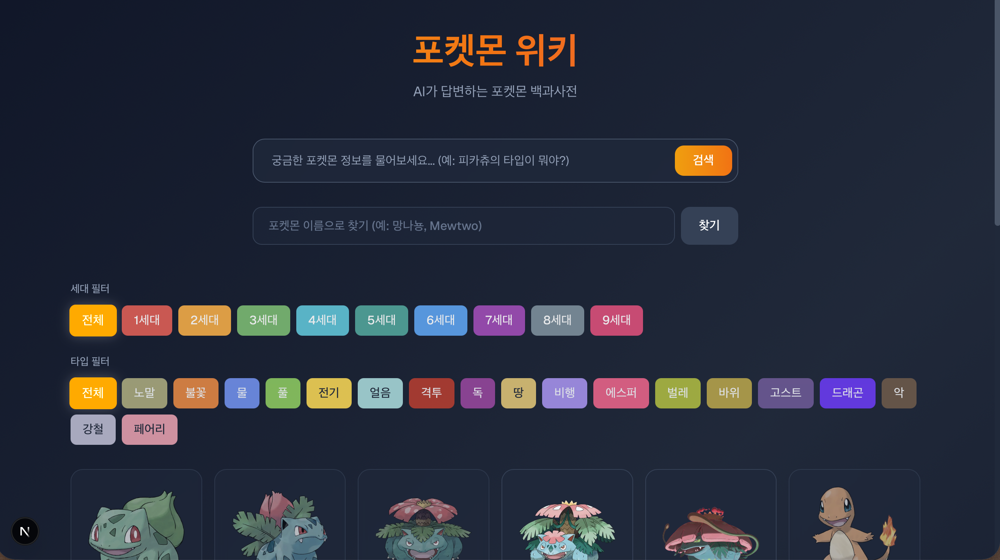

# 📱 포켓몬 위키 (Pokemon Wiki)

AI 지능형 검색과 최신 데이터를 결합한 차세대 포켓몬 백과사전입니다. Ollama(Gemma 3)를 활용하여 자연어 질문에 답변하고, 9세대 스칼렛/바이올렛 데이터를 포함한 방대한 정보를 시각적으로 제공합니다.

---

## 🚀 주요 기능

### 1. AI 지능형 챗봇 (Ollama 연동)
- **자연어 질의응답**: "피카츄의 약점이 뭐야?", "한카리아스랑 메가자리 중 누가 더 빨라?" 같은 질문에 실시간 답변.
- **스트리밍 인터페이스**: 답변이 생성되는 과정을 사용자에게 실시간으로 출력.
- **정확한 상성 계산**: LLM의 할루시네이션(환각)을 방지하기 위해 백엔드에서 직접 계산된 팩트 데이터를 조립하여 전달하는 아키텍처 적용.

### 2. 강력한 검색 및 필터링
- **다중 필터 지원**: 여러 세대(1~9세대)와 복합 타입(AND 검색)을 동시에 선택하여 정밀 탐색 가능.
- **이름 직접 검색**: 한글 및 영어 이름을 통한 부분 일치 대상을 빠르게 필터링.

### 3. 상세 정보 시각화
- **종족값 그래프**: 포켓몬의 능력치를 시각적인 바 차트로 표시.
- **습득 방식별 기술 정보**: 레벨업, 기술머신, 유전, 가르침 등 습득 경로에 따른 탭 UI 제공.
- **복잡한 진화 트리**: 아이템, 친밀도, 특정 장소 등 까다로운 진화 조건을 파싱하여 자연어로 설명.
- **최신 폼 데이터**: 알로라, 가라르, 히스이, 팔데아 지방의 리전폼 및 메가진화, 거다이맥스 정보 포함.

---

## 🛠 기술 스택

- **Frontend**: Next.js (App Router), Tailwind CSS (v4), Lucide React
- **Backend**: Next.js API Routes, better-sqlite3
- **Database**: SQLite (PokeAPI 기반 통합 구축)
- **AI Engine**: Ollama (gemma3 모델 최적화)
- **Language**: TypeScript

---

## 📂 프로젝트 구조

```text
pokemon_wiki/
├── src/
│   ├── app/                # Next.js 페이지 및 API 라우트
│   ├── lib/                # 코어 로직 (DB 제어, Ollama 프롬프트, 상성 계산)
│   └── components/         # 재사용 가능한 UI 컴포넌트
├── data/
│   └── pokemon.db          # 통합 포켓몬 SQLite 데이터베이스
├── scripts/
│   └── collect-data.ts    # PokeAPI 데이터 수집 및 가공 스크립트
├── test_matchup.ts         # 타입 상성 답변 정확도 검증 도구
└── next.config.ts          # 프로젝트 환경 설정
```

---

## ⚙️ 실행 방법

### 1. 사전 준비
- [Ollama](https://ollama.ai/)가 설치되어 있어야 하며, `gemma3` 모델을 다운로드해야 합니다.
  ```bash
  ollama pull gemma3
  ```

### 2. 의존성 설치
```bash
npm install
```

### 3. 로컬 서버 실행
```bash
npm run dev
```
브라우저에서 `http://localhost:3000`에 접속합니다.

---

## 🧪 품질 관리 및 개선 내역 (Improvement)

이 프로젝트는 특히 AI 답변의 신뢰도를 높이는 데 집중했습니다.

- **할루시네이션(Hallucination) 억제**: AI가 배율(4배/2배)을 추측하지 않도록 백엔드에서 `summary` 텍스트를 직접 생성하여 프롬프트 주입.
- **누락 데이터 수동 보정**: PokeAPI에 누락된 9세대 기술/특성 한글 명칭 100여 개를 수동으로 DB에 반영 완료.
- **상성 계산 로직 최적화**: 0배(무효) 상성이 반올림이나 연산 오류로 누락되지 않도록 로직 고도화.
